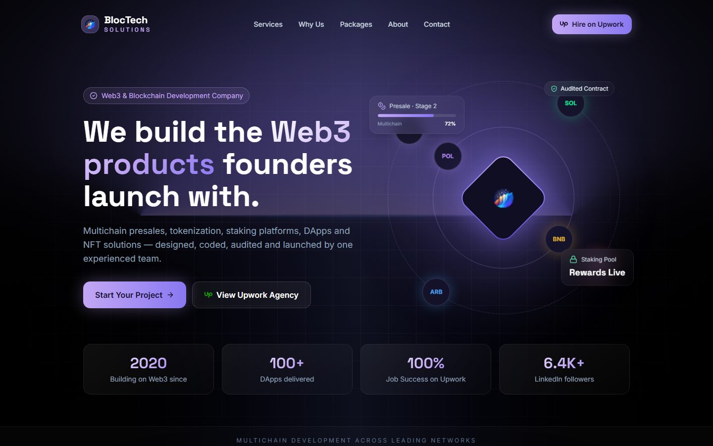
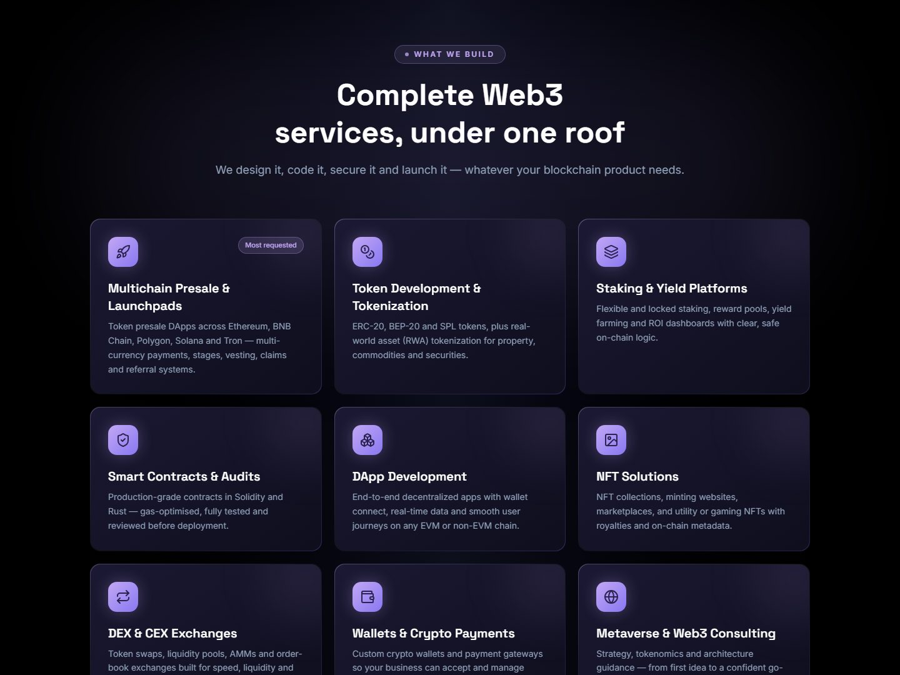
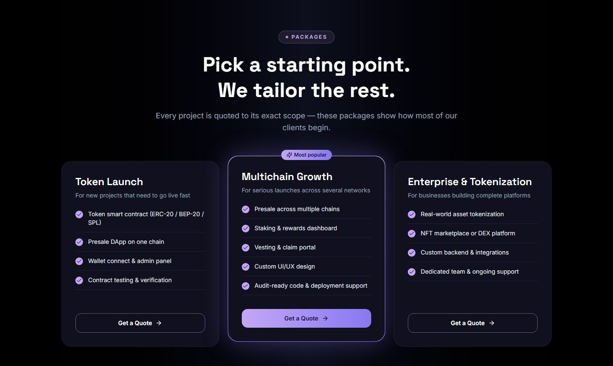
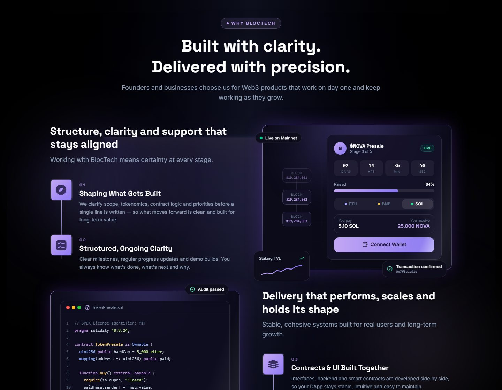
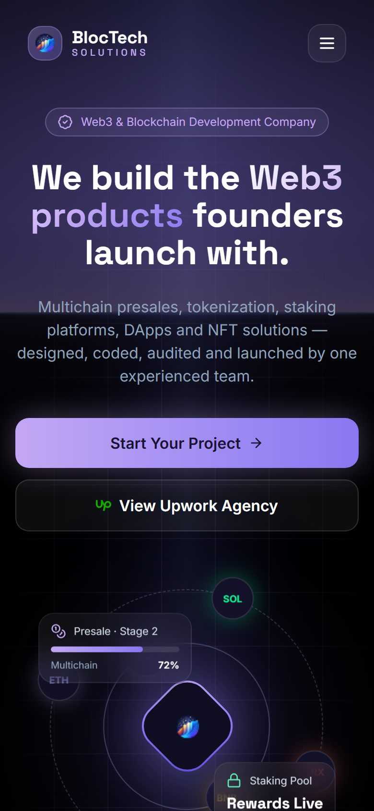
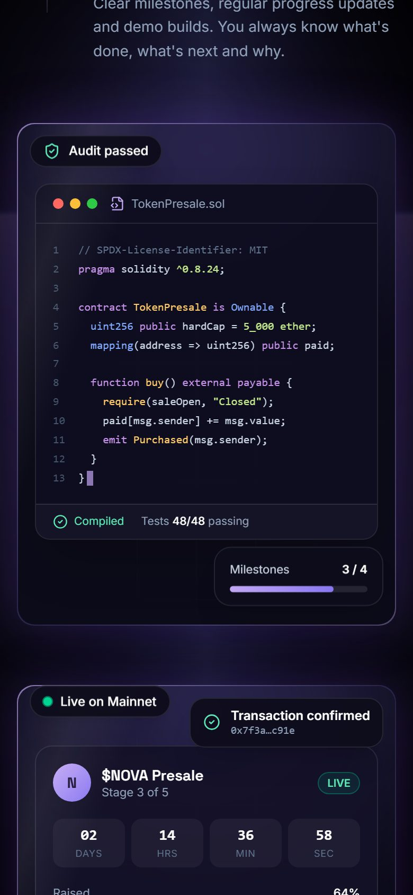

# BlocTech Solutions — Company Website

**Live site:** [bloctech-solution.netlify.app](https://bloctech-solution.netlify.app/)

The official website of **BlocTech Solutions**, a Web3 and blockchain development company founded in 2020. We build multichain presales, tokenization platforms, staking systems, DApps, NFT solutions, smart contracts, DEX/CEX exchanges and crypto wallets.

[](https://bloctech-solution.netlify.app/)


---

## Preview

<p align="center">
  <a href="https://bloctech-solution.netlify.app/">
    
  </a>
</p>

<table>
  <tr>
    <td width="50%"></td>
    <td width="50%"></td>
  </tr>
  <tr>
    <td align="center"><b>Web3 Services</b></td>
    <td align="center"><b>Packages</b></td>
  </tr>
</table>

<p align="center">
  
  <br />
  <b>Why BlocTech</b> — animated smart-contract editor and multichain presale DApp
</p>

<p align="center">
  
  &nbsp;&nbsp;
  
  <br />
  <b>Mobile view</b>
</p>

> Screenshots are static — visit the [live site](https://bloctech-solution.netlify.app/) to see the animations.

## Contents

- [Preview](#preview)
- [Page sections](#page-sections)
- [Tech stack](#tech-stack)
- [Getting started](#getting-started)
- [Project structure](#project-structure)
- [Editing content](#editing-content)
- [Deployment](#deployment)
- [Company links](#company-links)

## Page sections

| Section | What it shows |
| --- | --- |
| **Hero** | Headline, calls to action, animated blockchain orbit, key stats and a scrolling strip of supported chains |
| **Services** | Nine Web3 services, plus the full-stack capabilities strip |
| **Why BlocTech** | Four-step approach with scroll animations, a live smart-contract editor and a presale DApp demo |
| **Packages** | Token Launch, Multichain Growth and Enterprise & Tokenization |
| **About** | Founder profile and links to Upwork, LinkedIn and Instagram |
| **Contact** | Email, phone, office address and Upwork hire button |

The layout is responsive for phones, tablets and desktops. Animations are reduced for visitors who turn on "reduce motion" in their device settings.

## Tech stack

- [React 19](https://react.dev/) — UI components
- [Vite 7](https://vite.dev/) — dev server and production build
- [Tailwind CSS 4](https://tailwindcss.com/) — styling, theme colours and animations (`src/index.css`)
- [lucide-react](https://lucide.dev/) — icons
- Google Fonts — Inter and Space Grotesk

## Getting started

Requirements: [Node.js](https://nodejs.org/) 20 or newer.

```bash
npm install      # install dependencies
npm run dev      # start local dev server at http://localhost:5173
npm run build    # create production build in dist/
npm run preview  # preview the production build locally
npm run lint     # run ESLint
```

## Project structure

```
├── index.html               # page title, SEO meta tags, fonts
├── netlify.toml             # Netlify build settings
├── docs/screenshots/        # README preview images
├── public/
│   └── favicon.png
└── src/
    ├── data/site.js         # company details, social links, nav links, chains
    ├── index.css            # theme colours, fonts, keyframe animations
    ├── lib/useInView.js     # scroll-into-view hook for animations
    ├── assets/              # images and icons
    └── components/
        ├── Home.jsx         # page layout (section order)
        ├── Navbar.jsx       # sticky header + mobile menu
        ├── Hero.jsx         # top section
        ├── Web3Visual.jsx   # animated blockchain orbit
        ├── BuildGrid.jsx    # services
        ├── WorkWithUs.jsx   # "Why BlocTech" section
        ├── WhyUsVisuals.jsx # contract editor + presale DApp demos
        ├── BuildLast.jsx    # packages
        ├── About.jsx        # founder & profiles
        ├── Contact.jsx      # contact section
        ├── Footer.jsx
        ├── SocialIcons.jsx
        ├── SectionHeading.jsx
        └── Reveal.jsx       # fade/slide-in wrapper
```

## Editing content

- **Email, phone, address, social links:** `src/data/site.js`. Changes apply everywhere on the site.
- **Services:** the `services` list in `src/components/BuildGrid.jsx`.
- **Packages:** the `packages` list in `src/components/BuildLast.jsx`.
- **Hero stats:** the `stats` list in `src/components/Hero.jsx`.
- **Brand colours:** the `--color-*` values in `src/index.css`.

## Deployment

The site is hosted on **Netlify** at **https://bloctech-solution.netlify.app/**.

Build settings are in `netlify.toml`:

| Setting | Value |
| --- | --- |
| Build command | `npm run build` |
| Publish directory | `dist` |

To deploy manually, run `npm run build` and upload the `dist/` folder in the Netlify dashboard. If the site is connected to this Git repository, Netlify rebuilds automatically on every push.

## Company links

| | |
| --- | --- |
| 🌐 Website | [bloctech-solution.netlify.app](https://bloctech-solution.netlify.app/) |
| 💼 Upwork Agency | [upwork.com/agencies/1399256811672375296](https://www.upwork.com/agencies/1399256811672375296/) |
| 👤 CEO on Upwork | [upwork.com/freelancers/sulemanbloctech](https://www.upwork.com/freelancers/sulemanbloctech) |
| 🔗 LinkedIn | [linkedin.com/company/bloctech-solution](https://www.linkedin.com/company/bloctech-solution/) |
| 📸 Instagram | [instagram.com/bloctechsolutions](https://www.instagram.com/bloctechsolutions/) |
| 📘 Facebook | [facebook.com/BlocTechSolutions](https://www.facebook.com/BlocTechSolutions) |
| 🧑‍💻 Careers | [fitco.pk/employer-listing/bloctech-solutions](https://fitco.pk/employer-listing/bloctech-solutions/) |
| ✉️ Email | [contact@bloctechsolutions.com](mailto:contact@bloctechsolutions.com) |

---

© BlocTech Solutions. All rights reserved.
